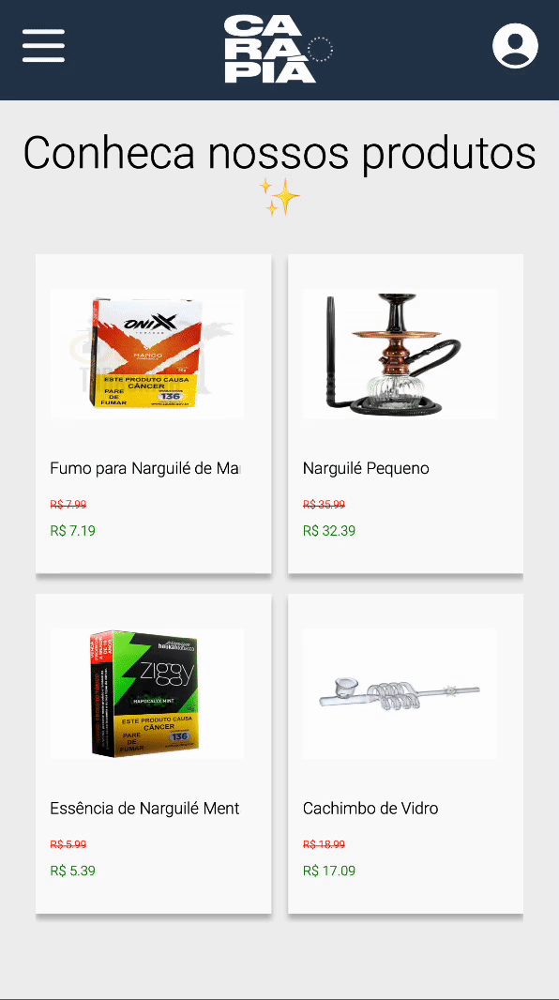

# EcommerceFront

Design of a Ecommerce application ! With the right to register, login, logout, and buy products !



Try it out now at https://projetao-ecommerce-front.vercel.app <br/>
Check out the backend too on https://github.com/mateuspit/projetao-ecommerce-back

## About

This is the Front-end of our full-stack web application ! With data persistence ! It's a simple Ecommerce, below are the implemented features:

- Sign Up
- Login
- LogOut
- List of products
- Cart
- Side menu
- Buy products

## Technologies
The following tools and frameworks were used in the construction of the project, you can find the full list on the package.json:<br>
<p>
  
  
  
  
  
  
  
  
  
  
  
  
  
  
</p>

## How to run

1. Clone this repository
2. Install dependencies
```bash
npm i
```
3. Create a .env file on the root of the project with the following variable on it
```bash
REACT_APP_API_URL=https://yourBackEndLink:PORT
```
4. Run the front-end with
```bash
npm start
```
5. You can optionally build the project running
```bash
npm run build
```
6. Finally access http://localhost:3000 on your favorite browser (unless it is Internet Explorer. In this case, review your life decisions)
